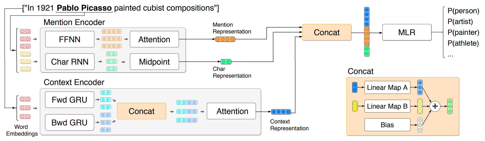

# A Fully Hyperbolic Neural Model for Hierarchical Multi-class Classification
Code for the paper ["A Fully Hyperbolic Neural Model for Hierarchical Multi-class Classification"](link to arxiv for now) published at Findings of EMNLP 2020

Model overview:
<p align="center"></p>


## Citation
The source code and data in this repository aims at facilitating the integration of hyperbolic components into neural models for NLP. 
If you use the code/data, please cite it as follows:
```
Add citation
```

## Dependencies
* ``python 3.7``
* ``PyTorch 1.4``
* ``geoopt 0.2.0``
* ``tqdm``
* ``tensorboardX``

## Running experiments

### 1. Download data
Download and uncompress Ultra-Fine dataset, and download Poincare word embeddings:
```
./scripts/hyfi.sh get_data
```

Experiments were run with ``poincare_glove_100D_cosh-dist-sq_init_trick.txt``.


### 2. Preprocess data 
The parameter ``poin-ctx25`` can be replaced to store different preprocessing configurations: 
```
./scripts/hyfi.sh preprocess poin-ctx25
```


### 3. Train model
The name of the preprocessing used in the previous step must be given as a parameter.
```
./scripts/hyfi.sh train poin-ctx25
```

### 3. Do inference
```
./scripts/figet.sh inference poin-ctx25 models/poin-ctx25-{N}bstep.pt
```

``N`` should be the number of the best epoch, according to the validation results.

## Acknowledgements
We kindly thank the open-source community for their support with high quality software, and specially to:

* [Choi et al.](https://homes.cs.washington.edu/~eunsol/papers/acl_18.pdf) for the release of the Ultra-Fine dataset and [their model](https://github.com/uwnlp/open_type).
* [Tifrea et al.](https://openreview.net/forum?id=Ske5r3AqK7) for the release of the [Poincare Glove word embeddings](https://github.com/alex-tifrea/poincare_glove).
* [Ganea et al.](https://papers.nips.cc/paper/7780-hyperbolic-neural-networks.pdf) for the release of the [Hyperbolic Neural Networks](https://github.com/dalab/hyperbolic_nn).
* [Kochurov et al.](https://arxiv.org/abs/2005.02819) for the implementation and release of the magnificent [Geoopt](https://github.com/geoopt/geoopt).

## License

[MIT](LICENSE)